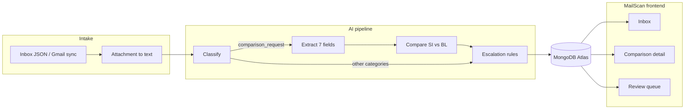

# MailScan

**AI-assisted shipping document verification for the Averis x Monash Hackathon 2026.**

MailScan turns a mixed shipping inbox into a triaged queue: classify every message, compare Shipping Instructions (SI) against draft Bills of Lading (BL), flag mismatches, and route uncertain cases to human reviewers — with full audit history in MongoDB.

> Built for shipping operations teams who today read hundreds of emails by hand and manually cross-check seven shipment fields across two documents before a BL is finalized.

---

## Problem–solution alignment

### The problem

A shipping documentation team receives one inbox for many job types:

| Pain | What goes wrong |
| --- | --- |
| **Triage takes time** | Comparison requests sit beside invoice queries, new SI requests, general ops mail, and spam. A missed comparison request never gets checked. |
| **Manual comparison is error-prone** | Shipper, consignee, notify party, ports, container count, and gross weight must match across SI and BL. One missed field causes corrections, delays, and rework. |
| **Same data, different labels** | "Port of Loading" on the SI may appear as "Load Port" on the BL. String matching alone creates false alarms or missed mismatches. |
| **Messy real-world inputs** | Scanned PDFs, corrupt files, wrong attachment types (packing list labelled as BL), missing attachments, and misleading subject lines are normal — not edge cases. |

### Our solution

MailScan maps each hackathon capability to a concrete user flow:

| Capability | What MailScan does |
| --- | --- |
| **Classify** | Every email gets a category (`comparison_request`, `new_si_request`, `invoice_query`, `general`, `spam`) with a confidence score. Only comparison requests enter the document pipeline. |
| **Extract** | For SI + BL pairs, an LLM reads plain text (from txt, PDF, xlsx, or docx) and maps label variants onto seven canonical fields. |
| **Compare** | A deterministic normalizer diffs SI vs BL side by side (`SI: 3 / BL: 4`). An LLM second opinion can resolve false positives — never flip a real mismatch to a match. |
| **Ask for help** | Low confidence, unreadable attachments, wrong doc types, or missing fields produce an escalation record with reasons and source evidence — not a silent guess. |

### Who benefits

- **Documentation staff** — inbox sorted by action; comparison results and mismatches in one screen.
- **Reviewers** — `/review` queue for errors and escalations; inline field correction and resolve actions on `/comparison/[emailId]`.
- **Ops leads** — every result stored in MongoDB for audit and replay.



---

## AI and cloud infrastructure integration

Hackathon rules require **meaningful AI** and **cloud infrastructure**. MailScan uses both end to end.

### AI components

| Layer | Technology | Role |
| --- | --- | --- |
| **Classification** | [Vercel AI Gateway](https://vercel.com/docs/ai-gateway) — default model `alibaba/qwen3.8-omni-flash` | Batch classifies emails from body intent (subjects in the dataset are deliberately unreliable). Same prompt in Python (`backend/classify.py`) and TypeScript (`src/lib/classify.ts`). |
| **Extraction** | Structured JSON-schema LLM calls via `backend/llm.py` | Maps label variants ("POL", "Load Port") onto canonical keys with per-field confidence and evidence lines. |
| **Comparison fallback** | LLM second opinion in `backend/comparison.py` | Resolves deterministic false positives only — never overrides a genuine mismatch. |
| **OCR (advanced)** | Google Document AI (`backend/ocr.py`) → vision-LLM fallback (`backend/ocr_llm.py`) | Reads image-only scanned PDFs when pdfplumber finds no text layer. |
| **Provider resilience** | Groq (`openai/gpt-oss-120b`) as automatic fallback | If the AI Gateway rate-limits or errors, Python stages retry on Groq without code changes elsewhere. |

> [!NOTE]
> Temperature is **0** everywhere. All LLM stages use strict JSON-schema output validated against Pydantic / TypeScript types — not regex-only parsing.

### Cloud infrastructure

| Service | Usage |
| --- | --- |
| **Vercel** | Hosts the Next.js frontend and API routes (`/api/sync`, `/api/auth/*`, `/api/review/*`). Serverless functions call the AI Gateway and MongoDB. |
| **MongoDB Atlas** | Shared data layer between the Python batch pipeline and the frontend. Collections: `emails`, `attachments`, `results`, `users`. |
| **Google Cloud** | Gmail OAuth + readonly sync for live inbox demo; Document AI for OCR (when credentials are configured). |
| **Docker (local)** | `docker compose up -d` runs MongoDB 7 for development (`averis-mongo` on `:27017`). |

### Integration boundary

The Python pipeline runs **out of band** (developer machine or CI) and writes finished `results` documents to MongoDB. The Vercel-hosted frontend **reads** those documents — the two sides never call each other directly. This keeps long-running LLM work off serverless timeouts while the UI stays live.

```bash
# Run the full pipeline and push results to the same DB the frontend reads
python -m backend.pipeline . --write-db
```

---

## User feedback and testing

### Automated validation

| Check | What it proves | How to run |
| --- | --- | --- |
| **Hand-labelled classifier sample** | 45/45 accuracy on acceptance emails | `python -m backend.cli eval-classify` |
| **Offline regression suite** | ~90 "send draft BL" patterns, ~70 inline-SI patterns, all 21 deliberate edge-case emails (500–520) | `pytest tests/` (201 tests) |
| **Attachment conversion** | 248/250 attachments convert to plain text (6 scanned PDFs via vision-LLM OCR; 2 corrupt PDFs remain unrecoverable) | `python -m backend.convert` |
| **Live Mongo round-trip** | Python `upsert_results` ↔ frontend `getComparisonResult` agree on schema | `RUN_LIVE_DB_TESTS=1 pytest tests/test_db.py` |
| **Self-evaluation scoreboard** | End-to-end accuracy vs private reference set | `POST /submit` via hackathon `loader.py` *(pending — bundle not yet in repo)* |

### Human-in-the-loop feedback

The frontend is built around reviewer actions, not a black-box report:

1. **Review queue** (`/review`) — filter by match / mismatch / error; sort by processed time or email ID.
2. **Comparison detail** (`/comparison/[emailId]`) — side-by-side SI vs BL values, attachment preview, escalation reasons.
3. **Inline correction** — reviewers fix a mismatched field; the result updates in MongoDB and can flip status back to match.
4. **Resolve escalation** — mark a case handled with a resolution note for audit.
5. **Gmail sync** (optional) — signed-in users pull live mail; classification streams progress via NDJSON so the inbox refreshes without manual reload.

### Testing during development

- Committed cache files (`data/classifications.json`) let teammates build without API keys.
- `npm run ingest -- --dry-run` validates ingest counts before writing to MongoDB.
- Edge-case emails 500–520 in the hackathon dataset were used as a fixed regression set (wrong attachment types, dropped files, scanned PDFs, blank SI fields).

> [!TIP]
> The self-eval scoreboard measures classification and mismatch detection — it does **not** fully score escalation quality. Test uncertain cases separately: unreadable PDFs, missing BL, and low-confidence extractions should land in the review queue with clear reasons.

---

## Coding challenges

Problems we hit building MailScan — and how we addressed them.

| Challenge | Impact | Our approach |
| --- | --- | --- |
| **Unreliable subject lines** | Classifier would follow thread titles instead of sender intent | Prompt trains on **body intent only**; attachment presence is an escalation signal, not a category signal |
| **Label variants across SI/BL** | "Port of Loading" vs "Load Port" breaks naive string compare | Normalize at **extraction time** into seven canonical keys; comparison is a deterministic diff on flat objects |
| **Format differences** | Same party written with different suffixes, units, or spacing | Pure-Python normalizers: casefold, strip `Pte Ltd`/`Inc`, parse `"3 x 40HC"`, convert tonnes/lbs → kg |
| **Multi-format attachments** | txt, pdf, xlsx, docx in one dataset | Single `readers.py` adapter → plain text once on disk; LLM stages never see raw binaries |
| **Scanned / image-only PDFs** | pdfplumber returns `pdf_no_text_layer` | Fallback chain: Document AI OCR → vision-LLM page transcription (`ENABLE_LLM_OCR_FALLBACK=1`) |
| **Corrupt PDF containers** | Broken xref tables vs missing trailers | `pikepdf` repair for recoverable corruption; genuine failures surface as `read_error` and escalate |
| **Wrong doc type attached** | Emails 501–505 attach packing lists / COO named `_BL` | Extraction returns `doc_type_detected`; mismatch triggers escalation before compare |
| **Duplicate attachments** | Same bytes, different filenames → false "2 SI" ambiguity | Content-hash dedup before extraction; evidence kept in `duplicate_attachments` |
| **LLM schema drift** | Models return bare arrays or fenced JSON despite `response_format` | Shared coercion layer in `backend/llm.py` and `src/lib/classify.ts`; one retry on validation failure |
| **Cross-language classifier parity** | Python batch vs TypeScript Gmail sync could diverge | Identical `SYSTEM_PROMPT`, batch size 10, same Gateway model and env vars |
| **Serverless sync timeouts** | Gmail + classify can exceed default limits | `maxDuration = 300` on `/api/sync`; streaming progress lines; client-side `AutoRefresh` polling |
| **Windows + pytest + pypdfium2** | Native access violation when OCR runs under pytest | Prefer `python -m backend.convert` for OCR smoke tests; pytest suite stays offline-mocked |

---

## Success metrics

Metrics we track today and targets aligned with the [final judging rubric](../clanker-food/Averis%20x%20Monash%20Hackathon%202026%20-%20Final%20Judging%20Rubric.md).

### Measured today

| Metric | Current result | Target |
| --- | --- | --- |
| Classifier accuracy (hand-labelled sample) | **45/45 (100%)** | Maintain on self-eval |
| Full inbox classified | **520/520** cached | All emails in submission JSON |
| Category distribution | general 151 · comparison 129 · new SI 125 · invoice 75 · spam 40 | Matches expected workload mix |
| Attachment conversion rate | **248/250 (99.2%)** | Escalate the 2 unrecoverable corrupt PDFs |
| Automated test suite | **201 tests** (200 pass + 1 gated live DB test) | Keep green on every PR |
| Known-good mismatch detection | `email_004` consignee/notify mismatch caught | No false "all clear" on real diffs |
| End-to-end pipeline | Classify → extract → compare → escalate → MongoDB | Full `--write-db` run on 520 emails *(next milestone)* |
| Self-eval scoreboard | Not yet submitted | Iterate until classification + mismatch F1 plateau |

### Product metrics (post-hackathon)

| Metric | Why it matters |
| --- | --- |
| **Time to first comparison result** | Staff currently spend minutes per email on triage alone |
| **Escalation precision** | % of review-queue items that truly needed human input (vs false escalations) |
| **Correction rate** | How often reviewers override AI extraction — feeds prompt and normalizer improvements |
| **Throughput** | Emails processed per hour with batch pipeline + optional Gmail sync |

---

## Future scalability

| Area | Plan |
| --- | --- |
| **Processing** | Move Python pipeline to a scheduled worker (Cloud Run, GitHub Actions, or small VM) with queue-based jobs per email |
| **Live updates** | Replace polling with MongoDB change streams on `results` for instant UI refresh |
| **OCR** | Production Document AI processor + quota monitoring; vision-LLM as fallback only |
| **Multi-tenant** | `owner` field already scopes emails and results per user; Gmail sync stores per-user inboxes |
| **Storage** | Attachment bytes in GridFS or object storage (S3/GCS) if inline MongoDB documents grow too large |
| **Horizontal scale** | Stateless Next.js on Vercel; MongoDB Atlas tiered by read/write volume; batch workers auto-scale on queue depth |
| **Model routing** | Keep Gateway as primary; route extraction to higher-accuracy models only for escalated or low-confidence docs |
| **Audit & compliance** | Immutable correction ledger, retention policies, role-based access on review actions |
| **Integrations** | Webhook notifications to TMS/ERP when a mismatch blocks BL finalization |

> [!IMPORTANT]
> The frontend stays read-heavy. All LLM-heavy work stays in the Python batch job so Vercel function limits and Gateway/Groq rate limits do not block the UI.

---

## Frontend structure

```
frontend/src/
├── app/
│   ├── page.tsx                    # Inbox (server component → MongoDB)
│   ├── review/page.tsx             # Review queue
│   ├── comparison/[emailId]/       # SI vs BL detail + corrections
│   ├── emails/[emailId]/           # Email detail
│   └── api/
│       ├── sync/route.ts           # Gmail pull + classify (streaming)
│       ├── auth/                   # Google OAuth + guest mode
│       └── review/[emailId]/       # correct / resolve actions
├── components/
│   ├── inbox-screen.tsx            # Filters, stats, pagination, sync UI
│   ├── comparison-screen.tsx       # 7-field table, attachment panes
│   ├── review-screen.tsx           # Escalation queue
│   └── auto-refresh.tsx            # Poll while sync runs
├── lib/
│   ├── classify.ts                 # TypeScript classifier (AI Gateway)
│   ├── gmail-sync.ts               # Gmail → MongoDB ingest rules
│   ├── results.ts                  # Read Result docs for UI
│   └── review-actions.ts           # Human correction / resolve writes
└── models/                         # Mongoose schemas (Email, Result, User, …)
```

### Key pages

| Route | Purpose |
| --- | --- |
| `/` | Inbox with category/confidence filters, attachment stats, Gmail sync |
| `/comparison/[emailId]` | Mismatch report, SI/BL side-by-side, inline correction |
| `/review` | Processed results queue — match, mismatch, and processing errors |
| `/login` | Google sign-in (optional — sample data works without auth) |

---


